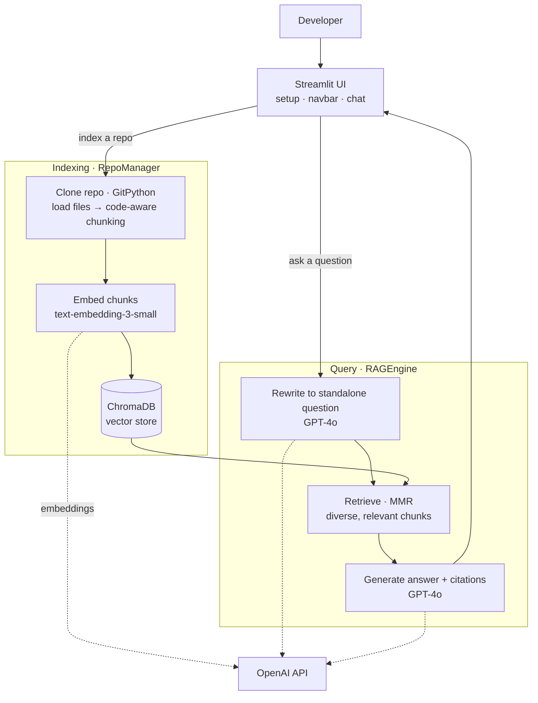

# 🧠 AI Codebase Onboarding Assistant

A RAG-powered tool that lets developers **chat with any Git repository**. Clone a repo, index the codebase into a vector database, and ask natural language questions — get accurate answers with source file references.

Built for developer onboarding, code exploration, and codebase documentation.

**Live Demo →** [ai-dev-onboard-platform.streamlit.app](https://ai-dev-onboard-platform.streamlit.app/)

---

## Features

**Multi-Repo Support** — Index multiple Git repositories and query across all of them in a single chat session.

**Conversational Chat** — Ask follow-up questions naturally. The assistant rewrites ambiguous queries into standalone questions using GPT-4o before searching, so retrieval stays accurate across multi-turn conversations.

**Smart Retrieval (MMR)** — Uses Maximal Marginal Relevance to balance relevance with diversity, avoiding redundant code snippets in the context window.

**Source Citations** — Every answer links back to the exact files and code snippets used, so you can verify and explore further.

**Passcode-Protected Advanced Settings** — Top-K, search strategy, and temperature controls are locked behind a passcode to keep the UI clean for regular users.

**Error Resilient** — Handles corrupted vector databases, failed clones, network errors, and bad metadata gracefully with user-friendly error messages.

---

## Tech Stack

| Component | Technology |
|-----------|-----------|
| Frontend | Streamlit |
| LLM | OpenAI GPT-4o |
| Embeddings | OpenAI text-embedding-3-small |
| Vector DB | ChromaDB |
| Framework | LangChain |
| Repo Loading | GitPython + LangChain GitLoader |

---

## Architecture



---

## Project Structure

```
version-2/
├── app.py              # Streamlit UI — setup screen, navbar, chat interface
├── repo_manager.py     # Git cloning, file loading, chunking, ChromaDB indexing
├── rag_engine.py       # Retrieval, query rewriting, prompt construction, LLM calls
├── requirements.txt    # Python dependencies
├── packages.txt        # System packages for Streamlit Cloud (git)
├── .python-version     # Pins Python 3.11 for Streamlit Cloud
├── .env.example        # Environment variable template
└── .gitignore
```

---

## Getting Started

### Prerequisites

- Python 3.11+
- OpenAI API key
- Git installed

### Local Setup

```bash
# 1. Clone this repo
git clone https://github.com/viswa1220/AI-Onboarding-Developer-Platform.git
cd AI-Onboarding-Developer-Platform/version-2

# 2. Install dependencies
pip install -r requirements.txt

# 3. Set up environment variables
cp .env.example .env
# Edit .env and add:
#   OPENAI_API_KEY=sk-your-key-here
#   ADVANCED_CODE=your-passcode

# 4. Run the app
streamlit run app.py
```

The app opens at `http://localhost:8501`.

### Usage

1. Paste a Git repo URL (e.g. `https://github.com/user/repo`)
2. Select the branch and file types to index
3. Click **Clone & Index** — wait for embedding to complete
4. Start chatting — ask about architecture, setup, specific functions, anything

---

## Deploy to Streamlit Cloud (Free)

1. Push your code to GitHub
2. Go to [share.streamlit.io](https://share.streamlit.io) and sign in
3. Click **New app** and configure:
   - **Repository:** `viswa1220/AI-Onboarding-Developer-Platform`
   - **Branch:** `owner`
   - **Main file path:** `version-2/app.py`
4. Click **Advanced settings** and add secrets:
   ```toml
   OPENAI_API_KEY = "sk-your-key-here"
   ADVANCED_CODE = "your-passcode"
   ```
5. Click **Deploy**

Your app will be live in ~2 minutes.

> **Note:** Streamlit Cloud's free tier has ephemeral storage. Cloned repos and the vector database reset when the app sleeps after ~7 days of inactivity. Users simply re-index when they return.

---

## How It Works

**1. Indexing** — The app clones the repo via Git, loads files matching selected extensions (skipping `node_modules`, `build`, etc.), and splits them into chunks using code-aware separators (splits on `class`, `def`, paragraph breaks). Each chunk is embedded using OpenAI's `text-embedding-3-small` and stored in ChromaDB.

**2. Retrieval** — When you ask a question, it's converted to an embedding and matched against stored chunks using MMR (Maximal Marginal Relevance), which returns diverse, relevant results instead of near-duplicate snippets.

**3. Query Rewriting** — For follow-up questions like "what about testing?", the engine uses GPT-4o to rewrite the query into a standalone question (e.g., "How is testing implemented in the TossTheTurf project?") before retrieval.

**4. Generation** — Retrieved chunks are assembled into a context block and sent to GPT-4o along with conversation history. The model generates an answer grounded in the actual code, with file references.

---

## Configuration

| Variable | Description | Default |
|----------|-------------|---------|
| `OPENAI_API_KEY` | OpenAI API key (required) | — |
| `ADVANCED_CODE` | Passcode to unlock advanced settings | `admin123` |

### Advanced Settings (passcode-protected)

| Setting | Description | Default |
|---------|-------------|---------|
| Top-K | Number of code chunks retrieved per query | 8 |
| Search Strategy | `mmr` (diverse) or `similarity` (pure relevance) | mmr |
| Temperature | LLM creativity (0.0 = factual, 1.0 = creative) | 0.2 |

---

## Cost

This app uses OpenAI's API. Approximate costs per repo indexing + 50 questions:

| Model | Usage | Cost |
|-------|-------|------|
| text-embedding-3-small | ~200K tokens for indexing | ~$0.004 |
| GPT-4o | ~50 queries | ~$0.50–1.00 |

Total: **under $1.50** for typical usage.

---

## License

MIT

---

## Author

**Viswanathan Varatharajan** — [GitHub](https://github.com/viswa1220)
